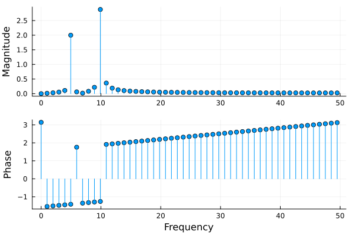

# EasyFFTs

[](https://KronosTheLate.github.io/EasyFFTs.jl/stable/)
[](https://KronosTheLate.github.io/EasyFFTs.jl/dev/)
[](https://github.com/KronosTheLate/EasyFFTs.jl/actions/workflows/CI.yml?query=branch%3Amain)
[](https://codecov.io/gh/KronosTheLate/EasyFFTs.jl)

##
Are you sick and tired of always doing the same preprocessing before you can visualize your fft? Look no further. EasyFFTs aims to automate common preprocessing of fft's, aimed at visual inspection of the frequency spectrum. The main workhorse of this package is a very simple function `easyfft` that modifies the output of `fft` and `rfft` from [FFTW.jl](https://github.com/JuliaMath/FFTW.jl) slightly.  

This function offers four main benefits to using the FFTW functions directly:
- The output is scaled by default, making the absolute value of the response 
correspond directly to the amplitude of the sinusoids that make up the signal.
- Simple and short syntax for getting the associated frequencies from sample frequency.
- Frequencies and response are sorted by increasing frequency (if you have ever used `fftshift` you know what I am talking about)
- `rfft` is automatically called for real input signals, avoiding 
the common mistake of always using `fft`. This makes it so that half of the symmetric 
spectrum is not computed, and not returned. This reduces computation and allocations, without loss of information. 
If you want both sides of the spectrum, use `easymirror`, with usage demonstrated in the docstring.

In case you also want to compute the "as the mathematicians define it" [Discrete Fourier Transform](https://en.wikipedia.org/wiki/Discrete_Fourier_transform), this package reexports everything exported from FFTW, so that `using EasyFFTs; fft(rand(100))` is equivalent to `using FFTW; fft(rand(100))`. The only difference between `using EasyFFTs` and `using FFTW` is therefore that EasyFFTs exports a few extra functions that mainly facilitate visualization of the spectrum.

# Examples
It is easier to explain by example, so view the examples below as a light introduction to all function defined in `EasyFFTs`, and how to use them.

## Setup
First, we need something to analyze. Let's define some sample-timestamps:
```julia
julia> using EasyFFTs

julia> fs = 100;  # sampling frequency

julia> timestamps = range(0, 1, step = 1 / fs);  # One second signal duration
```

We then make a signal `s` composed of 2 pure sinusoids with frequencies of 5 Hz and 10 Hz, sampled at `timestamps`:
```julia
julia> f1 = 5 ; A1 = 2;

julia> f2 = 10; A2 = 3;

julia> s = @. A1 * sin(f1 * 2π * timestamps) + A2 * sin(f2 * 2π * timestamps);
```

## How to use `easyfft`
Lets now use `easyfft`, and bind the output to `ef`:
```julia
julia> ef = easyfft(s, fs)
EasyFFT with 51 samples.
Dominant component(s):                  
   Frequency  │  Magnitude   
╺━━━━━━━━━━━━━┿━━━━━━━━━━━━━╸
     9.901    │   2.8796     
╶─────────────┼─────────────╴
    4.9505    │   1.9997     
```
The output is of the type `EasyFFT`, so to understand the output (bound to `ef`), we have to understand the type. 
It is not complicated at all. In fact, it essentially acts as a `NamedTuple`. 
The reason for wrapping the output in a new type is the pretty printing seen above, and 
automatic plotting. Note that the pretty printing rounds values to 5 significant digits.

## The `EasyFFT` type
The type `EasyFFT` contains frequencies and the corresponding (complex) responses.
There are 3 different ways to access the frequencies and responses, just like for named tuples.
The first is way "dot syntax":
```julia
 julia> ef.freq
51-element Vector{Float64}:
  0.0
  0.9900990099009901
  ⋮
 48.51485148514851
 49.504950495049506

 julia> ef.resp
51-element Vector{ComplexF64}:
 -9.578394722256253e-17 + 0.0im
 0.00042622566734221867 - 0.013698436692159435im
                        ⋮
  -0.025328817492520122 + 0.0011826329422999651im
   -0.02532460367843232 + 0.00039389110927144075im
```

Should you ever forget that you should use `freq` and `resp`, the Base Julia function `propertynames` will remind you.
```julia
julia> propertynames(ef)
(:freq, :resp)
```

The second method is iteration, which allows for [destructuring assignment](https://docs.julialang.org/en/v1/manual/functions/#destructuring-assignment) into seperate variables:
```julia
julia> frequencies, response = easyfft(s, fs);

julia> ef.freq == frequencies
true

julia> ef.resp == response
true
```

The third and final way of accessing the frequencies and response is indexing:
```julia
julia> ef.freq == frequencies == ef[1]
true

julia> ef.resp == response == ef[2]
true
```

## Convenience functions
Convenience functions are defined to extract the magnitude and phase of the response:
```julia
julia> magnitude(ef) == abs.(ef.resp)
true

julia> phase(ef) == angle.(ef.resp)
true
```

Appending a `d` to `phase` will get you the angle in degrees, analogous to `sin` and `sind`:
```julia
julia> phased(ef) == rad2deg.(phase(ef))
true
```

We saw that objects of the type `EasyFFT` are displayed 
as a table of the dominant frequencies. The functions used 
to find the dominant values are exported. 

We can get the dominant frequencies like so:
```julia
julia> domfreq(ef)
2-element Vector{Float64}:
 9.900990099009901
 4.9504950495049505
```

And their indices like so:
```julia
julia> finddomfreq(ef)
2-element Vector{Int64}:
 11
  6
```

Sometimes we want to know the response at a specific frequency. This 
functionality is provided by the `response_at` function:
```julia
julia> response_at(ef, 5)
(freq = 4.9504950495049505, resp = 0.3097558587965989 - 1.9756025627302725im)

julia> response_at(ef, [5, 10])
(freq = [4.9504950495049505, 9.900990099009901], resp = ComplexF64[0.3097558587965989 - 1.9756025627302725im, 0.881335139504854 - 2.741456352889268im])
```

Finally, you can get the symmetric spectrum for real signals using `easymirror`:
```julia
julia> easymirror(ef)
EasyFFT with 101 samples.
Dominant component(s):                   
   Frequency  │  Magnitude   
╺━━━━━━━━━━━━━┿━━━━━━━━━━━━━╸
    -9.901    │   1.4398     
╶─────────────┼─────────────╴
     9.901    │   1.4398     
╶─────────────┼─────────────╴
    -4.9505   │   0.99987    
╶─────────────┼─────────────╴
    4.9505    │   0.99987    
```
The amplitudes are adjusted correctly, halving the magnitude of 
all component except for the 0 Hz component.

With the conveniences related to the specifics of this package covered, it it time for a final convenience more related to the theory begind the DFT. The `easyfft` function can take a windowing function as the second argument. It is quite common to add a windowing function to reduce [spectral leakage](https://en.wikipedia.org/wiki/Spectral_leakage). For example, adding the `hanning` window from [`DSP.jl`](https://github.com/JuliaDSP/DSP.jl) makes the magnitudes of the FFT even closer to the true magnitudes:
```
julia> using DSP

julia> ef = easyfft(s, hanning, fs)
EasyFFT with 51 samples.
Dominant component(s):
   Frequency  │  Magnitude
╺━━━━━━━━━━━━━┿━━━━━━━━━━━━━╸
     9.901    │   2.9827
╶─────────────┼─────────────╴
    4.9505    │   1.9955
```

That wraps up the examples for the functions defined in `EasyFFTs`. Each function has a docstring with a lot more detail about the method signatures and arguments, so check that out if if you have questions. If anything is still unclear, please [open up an issue](https://github.com/KronosTheLate/EasyFFTs.jl/issues/new).


## Plotting
Because the returned value is of a custom type, automatic plot recipes can be defined. This has been done for [Plots.jl](https://github.com/JuliaPlots/Plots.jl):
```julia
using Plots
plot(ef)
```
  
For less than 100 datapoints, the plot defaults to a stem plot, which is the most appropriate for showing discrete quantities. 
However, stem plots get messy and slow with too many points, which is why the default changes to a line plot if there 
are 100 datapoints or more. Change the keywords `seriestype` and `markershape` in the call to `plot` to customize the behavior.